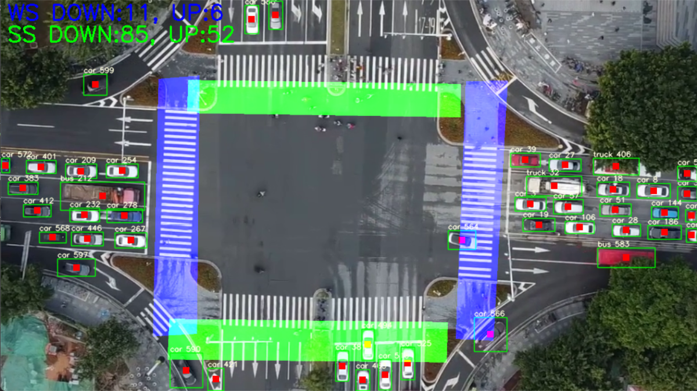

# yolov5-5.0 deepsort  
航拍视角下交叉口各流向各类型车辆检测+追踪+计数

- 自定义 交叉口12种流向 分别计数
- 默认检测类别（'car','truck','bus','van','feright car'）
- 航拍车辆检测数据源（DroneVehicle）

## 运行main.py，按车流方向自定义上下游检测框

## 使用框架

- https://github.com/dyh/unbox_yolov5_deepsort_counting
- https://github.com/Sharpiless/Yolov5-deepsort-inference
- https://github.com/ultralytics/yolov5/
- https://github.com/ZQPei/deep_sort_pytorch
- https://github.com/VisDrone/DroneVehicle
